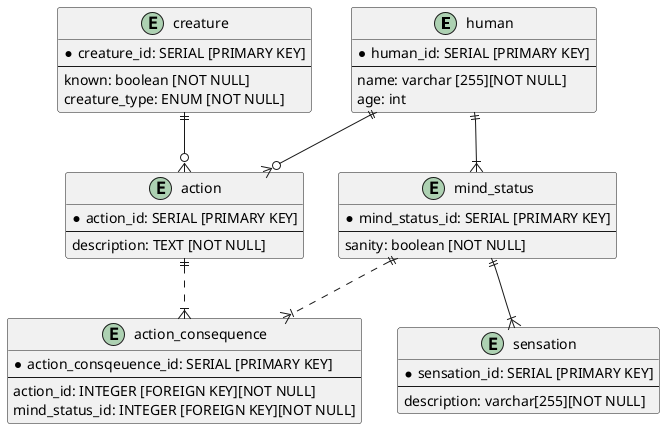

## Data Relationship model

```plantuml
@startuml

entity "human" as human{
    *human_id: SERIAL [PRIMARY KEY]
    --
    name: varchar [255][NOT NULL]
    age: int
}
entity "action" as action{
    * action_id: SERIAL [PRIMARY KEY]
    --
    description: TEXT [NOT NULL]
}
entity "mind_status" as mind_status{
    *mind_status_id: SERIAL [PRIMARY KEY]
    --
    sanity: boolean [NOT NULL]
}
entity "creature" as creature{
    *creature_id: SERIAL [PRIMARY KEY]
    --
    known: boolean [NOT NULL]
    creature_type: ENUM [NOT NULL]
}
entity "sensation" as sensation{
    *sensation_id: SERIAL [PRIMARY KEY]
    --
    description: varchar[255][NOT NULL]
}
entity "action_consequence" as action_consequence{
    * action_consqeuence_id: SERIAL [PRIMARY KEY]
    --
    action_id: INTEGER [FOREIGN KEY][NOT NULL]
    mind_status_id: INTEGER [FOREIGN KEY][NOT NULL]
}


mind_status ||--|{ sensation
 human ||--o{ action
creature ||--o{ action

human ||--|{ mind_status

mind_status ||..|{ action_consequence
action ||..|{ action_consequence
@enduml
```