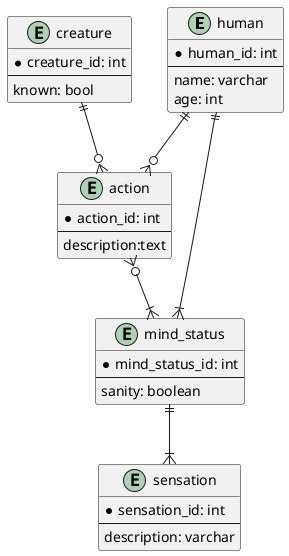

## uml: ER class diagram

```plantuml
@startuml

entity "human" as human{
    *human_id: int
    --
    name: varchar
    age: int
}

entity "action" as action{
    * action_id: int
    --
    description:text
}

entity "mind_status" as mind_status{
    *mind_status_id: int
    --
    sanity: boolean
}
entity "creature" as creature{
    *creature_id: int
    --
    known: bool
}
entity "sensation" as sensation{
    *sensation_id: int
    --
    description: varchar
}

human ||--o{ action
creature ||--o{ action

human ||--|{ mind_status
action }o--|{ mind_status

mind_status ||--|{ sensation

@enduml
```

<!-- 
действие аффектит чувство, а чувство аффектит человека и его разум. в первую очередь разум. 

 -->