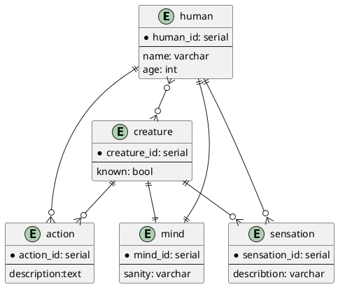

## uml: class diagram

```plantuml
@startuml
entity "human" as human{
    *human_id: serial
    --
    name: varchar
    age: int
}

entity "action" as action{
    * action_id: serial
    --
    description:text
}

entity "mind" as mind{
    *mind_id: serial
    --
    sanity: varchar
}
entity "creature" as creature{
    *creature_id: serial
    --
    known: bool
}
entity "sensation" as sensation{
    *sensation_id: serial
    --
    describtion: varchar
}
human }o--o{ creature
human ||--|| mind
human ||--o{ action
human ||--o{ sensation
creature ||--o{ action
creature ||--|| mind
creature ||--o{ sensation


@enduml
```