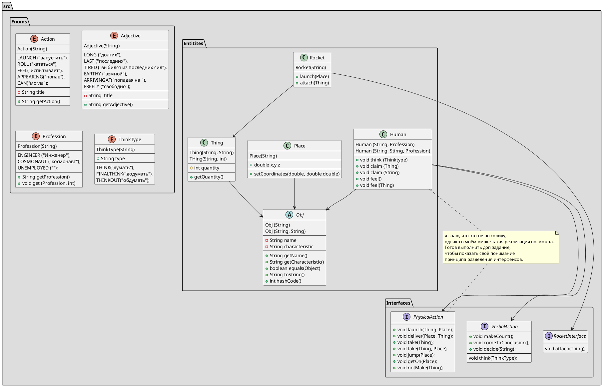

## uml: class diagram

```plantuml
@startuml
package src #DDDDDD {
    package "Entitites" #DDDDDD {
    abstract class Obj {
        Obj (String)
        Obj (String, String)
        --
        - String name
        - String characteristic
        --
        + String getName()
        + String getCharacteristic()
        + boolean equals(Object)
        + String toString()
        + int hashCode()
    }

    class Human {
        Human (String, Profession)
        Human (String, Stirng, Profession)
        --
        + void think (Thinktype)
        + void claim (Thing)
        + void claim (String)
        + void feel()
        + void feel(Thing)
    }
    class Place{
        Place(String)
        --
        + double x,y,z
        --
        + setCoordinates(double, double,double)
    }
    class Rocket{
        Rocket(String)
        --
        +launch(Place)
        +attach(Thing)
    }
    class Thing{
        Thing(String, String)
        THing(String, int)
        --
        # int quantity
        --
        + getQuantity()
    }

    Human --> Obj
    Place --> Obj
    Rocket --> Thing
    Thing --> Obj

    }

    package Enums #DDDDDD{
        enum Action{
            Action(String)
            --
            LAUNCH ("запустить"), 
            ROLL ("кататься"), 
            FEEL("испытывает"),
            APPEARING("попав"),
            CAN("могла");
            --
            - String title
            --
            + String getAction()
        }
        enum Adjective{
            Adjective(String)
            --
            LONG ("долгих"),
            LAST ("последних"),
            TIRED ("выбился из последних сил"),
            EARTHY ("земной"),
            ARRIVINGAT("попадая на "),
            FREELY ("свободно");
            --
            - String  title
            --
            + String getAdjective()
        }
        enum Profession{
            Profession(String)
            --
            ENGINEER ("Инженер"),
            COSMONAUT ("космонавт"), 
            UNEMPLOYED ("");
            --
            + String getProfession()
            + void get (Profession, int) 
        }
        enum ThinkType{
            ThinkType(String)
            --
            + String type
            --
            THINK("думать"),
            FINALTHINK("додумать"),
            THINKOUT("обдумать");
        }
    }
    package Interfaces #DDDDDD{
        interface PhysicalAction{
            + void launch(Thing, Place);
            + void deliver(Place, Thing);
            + void take(Thing);
            + void take(Thing, Place);
            + void jump(Place);
            + void getOn(Place);
            + void notMake(Thing);
        }
        interface RocketInterface{
            void attach(Thing);
        }
        interface VerbalAction{
            + void makeCount();
            + void comeToConclusion();
            + void decide(String);
            --
            void think(ThinkType);
        }
    }
    Human --> PhysicalAction
    Human --> VerbalAction
    Rocket --> RocketInterface
    note as n1
        я знаю, что это не по солиду,
        однако в моём мирке такая реализация возможна.
        Готов выполнить доп задание, 
        чтобы показать своё понимание
        принципа разделения интерфейсов. 
    end note
    Human .. n1
    n1 .. PhysicalAction
}


@enduml
```
