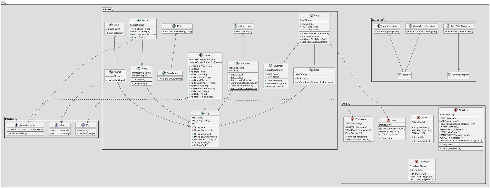

## uml: class diagram

```plantuml
@startuml
package src #DDDDDD {
    package "Exceptions"{
        class CabinsSetterException{
            + CabinsSetterExcepetion(Sring)
        }
        class CaveAirFillException{
            + CaveAirFillException(String)
        }
        class StatusException{
            + StatusException(String)
        }
        class RuntimeException{
        }
        class Exception{
        }
    }
    package "Entitites" #DDDDDD {
    class Animal{
        + Animal(String)
        --
        + void eatingGrass()
    }
    class Grass{
        + Grass(String)
        --
        + String getColor()
    }
    class Main{
        {static} public void main(String[] args)
    }
    abstract class Obj {
        Obj (String)
        Obj (String, String)
        Obj ()
        --
        - String name
        - String characteristic
        --
        + String getName()
        + String getCharacteristic()
        + boolean equals(Object)
        + String toString()
        + int hashCode()
    }
    class Antilunite{
        Abtilunite(String)
        Antilunite()
        --
        + {static} String clarity 
        + {static} String colour 
        + {static} String specificGravity
        + {static} String electricalConductivity
        + {static} String heatConductivity
        + {static} String meltingTemperature
    }
    class Antilunite_stats{
        + void showStats()
    }
    class Human {
        Human (String, Profession)
        Human (String, Stirng, Profession)
        --
        + void think (Thinktype)
        + void feel()
        + void feel(Thing)
        + void make(Thing)
        + void notMake(Thing)
        + void jump(Place)
        + void deliver(Place, Thing)
        + void makeCount()
        + void comeToConclusion()
        + void decide(String)
        + void take (Thing);
        + void take (Thing, Place);
    }
    class Place{
        Place(String)
        --
        + double x,y,z
        --
        + setCoordinates(double, double,double)
    }
    class Rocket{
        Rocket(String)
        --
        + void attach(Thing)
        + void setCabins(int)
        + void cabinsValidator(int)
        + int getCabins()
    }
    class Thing{
        Thing(String, String)
        Thing(String, int)
        --
        # int quantity
        --
        + getQuantity()
    }
    class Cave{
        Cave(String)
        --
        # Status status
        + final String walls
        + final String ceiling
        --
        + void statusValidator (Status)
        + Status getStatus()
        + void caveAirFIll(CaveDoor)
        + void closeCave(CaveDoor)
    }
    class CaveDoor{
        + CaveDoor(String)
        --
        # String name
        # Status status
        --
        + String getName()
        + void setStatus(Status)
        + Status getStatus()
    }
    class SolarPanel{
        --
        + void generateEnergy()
    }
}


    package Enums #DDDDDD{
        enum Status{
            Status(String)
            --
            DEFAULT("неизвестный"),
            OPENED("открыто"),
            CLOSED("закрыто");
            --
            - String status
        }
        enum Action{
            Action(String)
            -- 
            ROLL ("кататься"), 
            APPEARING("попав"),
            CAN("могла");
            --
            - String title
            --
            + String getAction()
        }
        enum Adjective{
            Adjective(String)
            --
            LONG ("долгих"),
            LAST ("последних"),
            TIRED ("выбился из последних сил"),
            EARTHY ("земной"),
            ARRIVINGAT("попадая на "),
            FREELY ("свободно"),
            TRANSPARENT("прозрачный"),
            PURPLE("фиолетовый"),
            FILLEDWITHAIR("наполненный воздухом");
            --
            - String  title
            --
            + String getAdjective()
        }
        enum Profession{
            Profession(String)
            --
            ENGINEER ("Инженер"),
            COSMONAUT ("космонавт"), 
            UNEMPLOYED ("");
            --
            + String getProfession()
            + void get (Profession, int) 
        }
        enum ThinkType{
            ThinkType(String)
            --
            + String type
            --
            THINK("думать"),
            FINALTHINK("додумать"),
            THINKOUT("обдумать");
        }
    }
    package Interfaces #DDDDDD{
        interface Iclaim{
            + void claim (Thing)
            + void claim (String)

        }
        
        interface IFeel{
            + void feel();
            + void feel(Thing t);            
        }

        interface IRocketInteraction{
            + default void launch (Rocket, Place);
            --
            + void attach(Thing);
        }
        }
    }

    Grass +-- Animal
    Antilunite_stats +-- Antilunite
    Cave +-- CaveDoor
    Main +--SolarPanel
    Cave ..> Status
    Human ..> Iclaim
    Human ..> IFeel
    Human ..> Profession
    Human ..> IRocketInteraction
    Rocket ..> IRocketInteraction
    Animal ..> Iclaim 
    Antilunite --|> Obj
    Human --|> Obj
    Place --|> Obj
    Rocket --|> Thing
    Cave --|> Place
    Thing --|> Obj
    Animal --|> Obj
    CabinsSetterException --|> Exception
    CaveAirFillException --|> RuntimeException
    StatusException --|> Exception


@enduml
```
