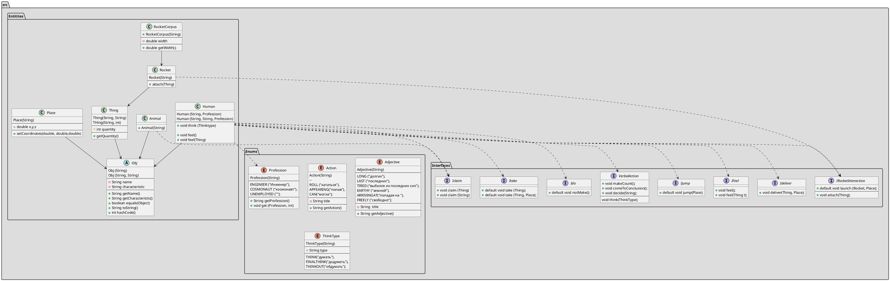

## uml: class diagram

```plantuml
@startuml
package src #DDDDDD {
    package "Entitites" #DDDDDD {
    class Animal{
        + Animal(String)

    }
    class RocketCorpus{
        + RocketCorpus(String)
        --
        - double width
        --
        + double getWidth();
    }
    abstract class Obj {
        Obj (String)
        Obj (String, String)
        --
        - String name
        - String characteristic
        --
        + String getName()
        + String getCharacteristic()
        + boolean equals(Object)
        + String toString()
        + int hashCode()
    }

    class Human {
        Human (String, Profession)
        Human (String, Stirng, Profession)
        --
        + void think (Thinktype)

        + void feel()
        + void feel(Thing)
    }
    class Place{
        Place(String)
        --
        + double x,y,z
        --
        + setCoordinates(double, double,double)
    }
    class Rocket{
        Rocket(String)
        --
        +attach(Thing)
    }
    class Thing{
        Thing(String, String)
        THing(String, int)
        --
        # int quantity
        --
        + getQuantity()
    }

}


    package Enums #DDDDDD{
        enum Action{
            Action(String)
            -- 
            ROLL ("кататься"), 
            APPEARING("попав"),
            CAN("могла");
            --
            - String title
            --
            + String getAction()
        }
        enum Adjective{
            Adjective(String)
            --
            LONG ("долгих"),
            LAST ("последних"),
            TIRED ("выбился из последних сил"),
            EARTHY ("земной"),
            ARRIVINGAT("попадая на "),
            FREELY ("свободно");
            --
            - String  title
            --
            + String getAdjective()
        }
        enum Profession{
            Profession(String)
            --
            ENGINEER ("Инженер"),
            COSMONAUT ("космонавт"), 
            UNEMPLOYED ("");
            --
            + String getProfession()
            + void get (Profession, int) 
        }
        enum ThinkType{
            ThinkType(String)
            --
            + String type
            --
            THINK("думать"),
            FINALTHINK("додумать"),
            THINKOUT("обдумать");
        }
    }
    package Interfaces #DDDDDD{
        interface Iclaim{
            + void claim (Thing)
            + void claim (String)

        }
        interface Itake{
            + default void take (Thing);
            + default void take (Thing, Place);
        }
        
        interface Ideliver{
            + void deliver(Thing, Place);
        }
        interface IFeel{
            + void feel();
            + void feel(Thing t);            
        }
        interface Ijump{
            + default void jump(Place);
        }

        interface IRocketInteraction{
            + default void launch (Rocket, Place);
            --
            + void attach(Thing);
        }
        interface Ido{
            + default void notMake();
        }
        interface VerbalAction{
            + void makeCount();
            + void comeToConclusion();
            + void decide(String);
            --
            void think(ThinkType);
        }
        }
    }
    Human --> Obj
    Place --> Obj
    Rocket --> Thing
    RocketCorpus --> Rocket
    Thing --> Obj
    Human ..> Iclaim
    Human ..> Ideliver
    Human ..> Ijump
    Human ..> Ido
    Human ..> IFeel
    Human ..> Itake
    Human ..> VerbalAction
    Human ..> Profession
    Human ..> IRocketInteraction
    Rocket ..> IRocketInteraction
    Animal --> Obj
    Animal ..> Iclaim 


@enduml
```
