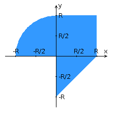

# Laboratory work №4
## Variant 776

Rewrite the application from the previous lab using the following technologies:

    The back-end layer should be based on Java EE (EJB must be used).
    The front-end layer should be built on React + Redux (ES6 and JSX must be used) using the PrimeReact component set
    The interaction between the back-end and front-end layers should be organized via the REST API.

The application should still include 2 pages - the start and main application pages. Both application pages should be adapted for display in 3 modes:

    "Desktop" - for devices with a screen width equal to or greater than 1205 pixels.
    "Tablet" - for devices with a screen width equal to or greater than 859, but less than 1205 pixels.
    "Mobile" - for devices with a screen width less than 859 pixels.

The start page should contain the following elements:

    "Header" containing the student's full name, group number, and option number.
    A form for entering login and password. Information about users registered in the system should be stored in a separate DB table (the password should be stored as a hash sum). Unauthorized users should be denied access to the main page of the application.

The main page of the application should contain the following elements:

    A set of input fields for specifying the coordinates of a point and the radius of an area in accordance with the assignment option: Slider (-5 ... 3) for the coordinate along the X axis, Text (-3 ... 3) for the coordinate along the Y axis, and Slider (-5 ... 3) for specifying the radius of an area. If an input field allows the input of obviously incorrect data (such as letters in the coordinates of a point or a negative radius), the application should validate them.
    A dynamically updated image depicting an area on a coordinate plane in accordance with the number of the option and the point whose coordinates were specified by the user. Clicking on the image should initiate a script that determines the coordinates of a new point and sends them to the server to check whether it falls within the area. The color of the dots should depend on whether the area is hit/missed. Changing the radius should also trigger a redraw of the image.
    A table with a list of results of previous checks.
    A link by which the authenticated user can close their session and return to the application start page.

Additional application requirements:

- All check results should be saved in a database running PostgreSQL.
- JPA must be used to access the database.

